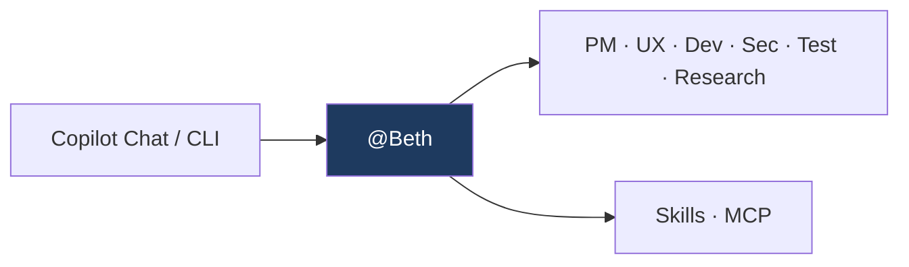
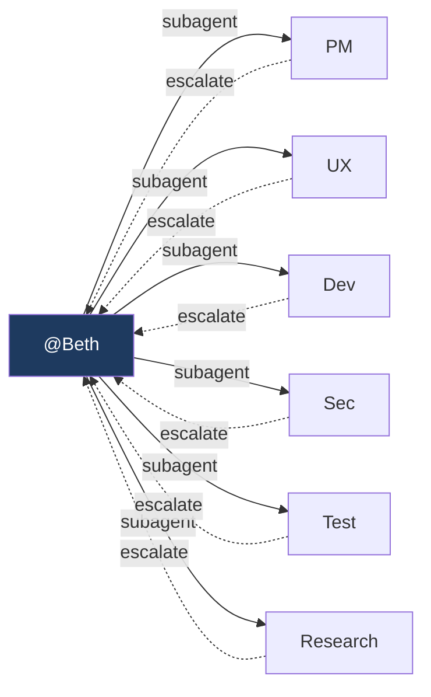
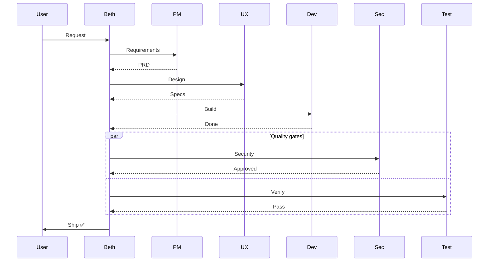
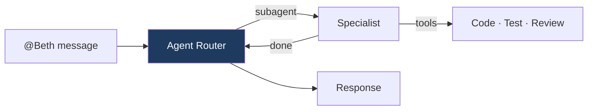
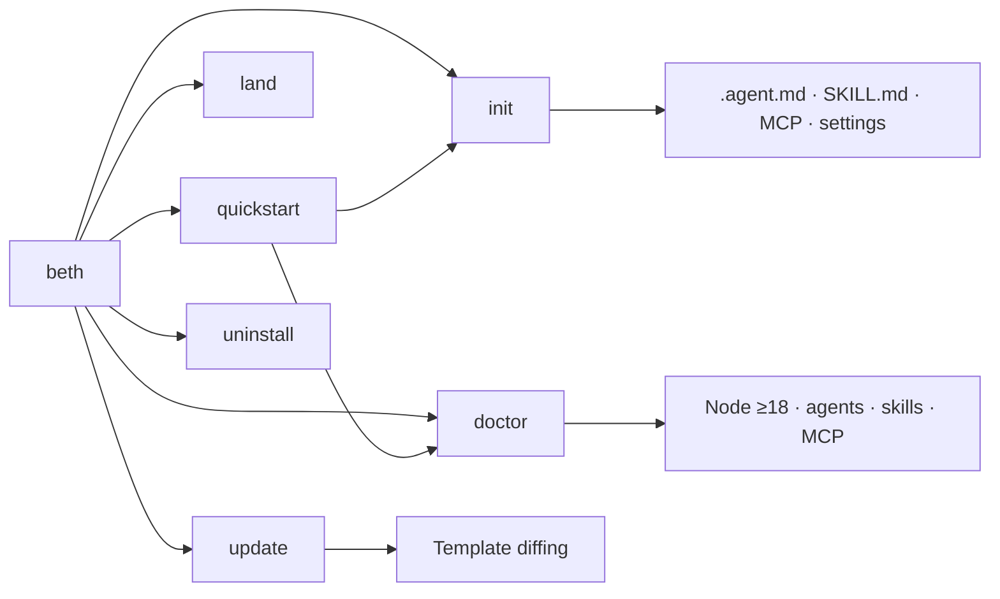
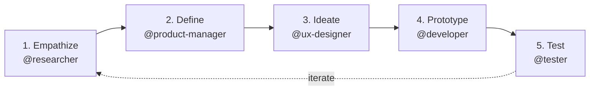
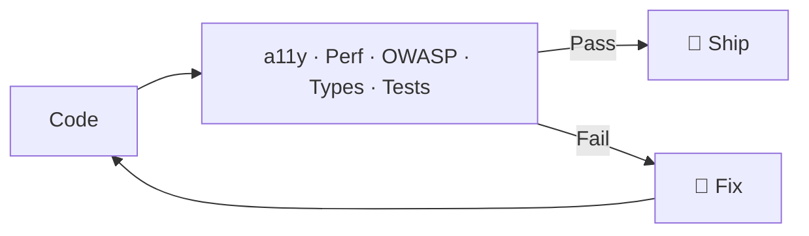

# Beth

<p align="center">
  
</p>

She doesn't do excuses. She doesn't do hand-holding. She does results—and she'll have your entire project shipping while everyone else is still scheduling their kickoff meeting. Think of her as the managing director your codebase didn't know it needed, but absolutely deserves.

They broke her wings once. They forgot she had claws.

---

## What Is This?

Beth is a **multi-agent AI orchestrator** with a TypeScript runtime, CLI toolchain, MCP integrations, and subagent delegation—all driven by a ruthless coordinator who runs your development team the way Beth Dutton runs Schwartz & Meyer.

She commands seven specialized agents, each with their own expertise, tools, and handoff chains. On top of the GitHub Copilot agent layer, Beth ships a **TypeScript core engine** with a full agentic loop: agent routing, conversation context management, tool calling, subagent spawning, and agent handoffs—all backed by an Azure OpenAI LLM provider with streaming and retry.

**The system has four execution layers:**

| Layer | What It Does | Status |
|-------|-------------|--------|
| **Copilot Agents** | `.agent.md` definitions running in VS Code Agent Mode | Live |
| **CLI Toolchain** | `beth init`, `beth doctor`, `beth land`, `beth update` — TypeScript commands | Live |
| **Orchestration Engine** | Fan-out routing, tool calling loop, subagent spawning, handoffs | Live |
| **Agent Tools** | Copilot built-ins (codebase, readFile, editFiles, runSubagent) + optional MCP servers | Live |
| **LLM Provider** | Azure OpenAI with Entra ID auth, streaming, retry, tool calling | Live |

---

## Architecture


```mermaid
flowchart LR
    Input["Copilot Chat / CLI"] --> Beth["@Beth"]
    Beth --> Agents["PM · UX · Dev · Sec · Test · Research"]
    Beth --> Skills["Skills · MCP"]

    style Beth fill:#1e3a5f,color:#fff
```

---

## Tech Stack

| Category | Technology | Notes |
|----------|-----------|-------|
| **Runtime** | Node.js 20.19.x or ≥ 22.12 (Node 21.x not supported) | ES modules, built-in test runner |
| **Language** | TypeScript (strict mode) | No `any`. Zod for runtime validation |
| **Target Framework** | React 19 + Next.js App Router | Server Components, Server Actions, Suspense, streaming |
| **Styling** | Tailwind CSS + `class-variance-authority` (cva) | Utility-first with typed variants |
| **Components** | shadcn/ui | Radix primitives, copy-paste ownership |
| **LLM Provider** | Azure OpenAI via `openai` SDK | Entra ID auth (no API keys), streaming + tool calling |
| **Auth** | `@azure/identity` DefaultAzureCredential | az login, managed identity, VS Code creds |
| **Frontmatter** | `gray-matter` | Parses `.agent.md` and `SKILL.md` YAML |
| **Testing** | vitest | Unit, integration, E2E |
| **Task Tracking** | Backlog.md (`backlog` CLI) | Markdown-based task tracking for agents and humans |
| **Package Manager** | npm | Lockfile committed |

**Production dependencies:** 1 (`gray-matter`). Minimal attack surface by design.

---

## Getting Started

**One command:**
```bash
npx beth-copilot init
```

**Global install:**
```bash
npm i -g beth-copilot
beth init
```

Then open VS Code, switch Copilot Chat to **Agent mode**, and type `@Beth`.

**Verify everything works:**
```bash
beth doctor       # Health check: Node.js, agents, skills
beth quickstart   # Init + doctor in one shot
```

For detailed setup (prerequisites, task tracking, MCP servers): [docs/INSTALLATION.md](docs/INSTALLATION.md)

---

## CLI Commands

| Command | What It Does |
|---------|-------------|
| `beth init` | Install agents, skills, VS Code settings, MCP config, Backlog.md tracking, pre-push hook. Auto-derives backlog prefix from project name. |
| `beth init --force` | Overwrite existing files |
| `beth doctor` | Validate Node.js ≥20.19, agents frontmatter, skills, required MCP servers |
| `beth quickstart` | Run init + doctor in one shot |
| `beth land` | Automate session completion: tests, commit, push, verify sync |
| `beth update` | Update project files to latest templates without full re-init |
| `beth uninstall` | Remove all Beth files from current project (agents, skills, hooks, config) |
| `beth help` | Show all commands and options |

**Flags:** `--force`, `--skip-backlog`, `--skip-mcp`, `--verbose`, `--skip-tests`, `--message/-m`, `--dry-run`, `--check-only`

---

## Agent Orchestration

Beth doesn't micromanage. She delegates to specialists over **subagent** and **handoff** channels, tracks work in Backlog.md, and holds every agent accountable.

### The Family

| Agent | Role | What They Do |
|-------|------|--------------|
| **@Beth** | The Boss | Orchestrates everything. Routes work. Takes names. |
| **@product-manager** | The Strategist | WHAT to build: PRDs, user stories, priorities, success metrics |
| **@researcher** | The Intelligence | Competitive analysis, user insights, market dirt |
| **@ux-designer** | The Architect | HOW it works: component specs, design tokens, accessibility |
| **@developer** | The Builder | React/TypeScript/Next.js — UI and full-stack |
| **@tester** | The Enforcer | Quality assurance, accessibility, performance |
| **@security-reviewer** | The Bodyguard | OWASP, compliance, threat modeling |

### Delegation Model (Hub-and-Spoke)


```mermaid
flowchart LR
    Beth["@Beth"] -->|subagent| PM["PM"] & UX["UX"] & Dev["Dev"] & Sec["Sec"] & Test["Test"] & Res["Research"]
    PM -.->|escalate| Beth
    UX -.->|escalate| Beth
    Dev -.->|escalate| Beth
    Sec -.->|escalate| Beth
    Test -.->|escalate| Beth
    Res -.->|escalate| Beth

    style Beth fill:#1e3a5f,color:#fff
```

All agents escalate exclusively to Beth — no lateral handoffs. Beth routes, agents execute.

### Subagent vs Handoff

| Mechanism | Control | Use When |
|-----------|---------|----------|
| **Subagent** | Beth decides | Task can run autonomously, no human review needed |
| **Handoff** | User decides | User needs to review before proceeding |

```typescript
// Beth spawns a specialist — autonomous execution
runSubagent({
  agentName: "developer",
  prompt: "Implement JWT auth flow with refresh token rotation...",
  description: "Implement auth"
})
```

### Workflow: New Feature


```mermaid
sequenceDiagram
    participant U as User
    participant B as Beth
    participant PM as PM
    participant UX as UX
    participant D as Dev
    participant S as Sec
    participant T as Test

    U->>B: Request
    B->>PM: Requirements
    PM-->>B: PRD
    B->>UX: Design
    UX-->>B: Specs
    B->>D: Build
    D-->>B: Done
    par Quality gates
        B->>S: Security
        S-->>B: Approved
    and
        B->>T: Verify
        T-->>B: Pass
    end
    B->>U: Ship ✅
```

**Bug Hunt?** Tester → Developer → Security → Tester
**Security Audit?** Security → Developer → Tester → Security sign-off

---

## MCP Integrations

Model Context Protocol servers extend agent capabilities. All **optional** — agents gracefully degrade without them.

| Server | Agent | Capability |
|--------|-------|-----------|
| **shadcn/ui** | Developer | Component browsing & installation |
| **Playwright** | Tester | Browser automation, E2E testing |
| **Azure** | Developer, Security | Cloud resource management |
| **Brave Search** | Researcher | Internet research |
| **DeepWiki** | All | Repository documentation lookup |

### Quick Setup

```bash
# Copy example config and enable what you need
cp mcp.json.example .vscode/mcp.json
```

```json
{
  "servers": {
    "shadcn":     { "command": "npx", "args": ["shadcn@latest", "mcp"] },
    "playwright": { "command": "npx", "args": ["@playwright/mcp@latest"] },
    "azure":      { "command": "npx", "args": ["@azure/mcp-server"] },
    "web-search": { "command": "npx", "args": ["@brave/brave-search-mcp-server"] },
    "deepwiki":   { "url": "https://mcp.deepwiki.com/mcp" }
  }
}
```

Full details: [docs/MCP-SETUP.md](docs/MCP-SETUP.md)

---

## Skills (On-Demand Knowledge)

Skills are domain-knowledge modules that agents load automatically when trigger phrases match. Each skill lives in `.github/skills/<name>/SKILL.md` or `.github/prompts/<name>/PROMPT.md`.

| Skill | Triggers On | Used By |
|-------|------------|---------|
| **PRD Generation** | "create a prd", "product requirements" | Product Manager |
| **UI UX Pro Max** | "design system", "color palette", "style guide" | UX Designer, Developer |
| **Web Design Guidelines** | "review my UI", "check accessibility" | UX Designer, Tester |
| **Framer Components** | "framer component", "property controls" | UX Designer, Developer |
| **React/Next.js Best Practices** | React performance, Next.js patterns | Developer |
| **shadcn/ui** | "shadcn", "ui component" | Developer |
| **Security Analysis** | "security review", "OWASP", "threat model" | Security Reviewer |
| **Azure Operations** | Azure resource management (27+ Azure skills) | Developer |
| **Web Search** | Internet research via Brave | Researcher |

### Design & UI Skills

Three complementary skills cover the full design-to-code pipeline. They don't overlap — each solves a different problem.

| Skill | What It Does | When You Need It |
|-------|-------------|------------------|
| **[UI UX Pro Max](https://github.com/nextlevelbuilder/ui-ux-pro-max-skill)** | Design system generator — picks styles, colors, typography, and layout patterns from a searchable database of 67 styles, 161 color palettes, 57 font pairings, and 161 industry-specific reasoning rules. | Starting a new project or page. "What should this look like?" |
| **Web Design Guidelines** | Code auditor — fetches live [Vercel Web Interface Guidelines](https://github.com/vercel-labs/web-interface-guidelines) and checks your actual files for accessibility, focus, form, and performance violations with `file:line` output. | Reviewing implemented code. "Is this built correctly?" |
| **Framer Components** | Framer platform SDK reference — `addPropertyControls`, `ControlType`, code overrides, `RenderTarget`, auto-sizing, and Framer Motion integration. | Building custom components inside Framer. "How do I make this work in Framer?" |

**Typical flow:** UI UX Pro Max generates the design system → Developer builds it → Web Design Guidelines audits the result. Framer Components is loaded only when targeting the Framer platform.

---

## How It Works

Beth runs inside VS Code Copilot Agent Mode. The `@Beth` agent parses requests, delegates to specialist agents via subagent spawning, and tracks work through Backlog.md.


```mermaid
flowchart LR
    Msg["@Beth message"] --> Route["Agent Router"]
    Route -->|subagent| Agent["Specialist"]
    Agent -->|tools| Work["Code · Test · Review"]
    Agent -->|done| Route
    Route --> Done["Response"]

    style Route fill:#1e3a5f,color:#fff
```

**Key capabilities:**
- **Agent routing** — `@mention` parsing, subagent spawning, handoff chains
- **Skill injection** — Domain knowledge loaded on trigger phrases
- **Task tracking** — Backlog.md (`backlog`) for tasks, milestones, and progress
- **MCP integration** — Optional external tool servers (shadcn, Playwright, Azure)

```
@Beth implement the login page
→ Beth routes to @developer, tracks work in Backlog.md

@Beth review this PR for security vulnerabilities
→ Beth routes to @security-reviewer, injects security-analysis skill

@Beth plan the dashboard feature
→ Beth routes to @product-manager for requirements, then @ux-designer for specs
```

> Invoke Beth by selecting `@Beth` in VS Code Copilot Chat (Agent Mode).

---

## Agent Tools

Beth's agents leverage VS Code Copilot's built-in tools alongside task tracking through the `backlog` CLI. The orchestration layer delegates to these capabilities:

| Tool | What It Does |
|------|-------------|
| **codebase** | Semantic code search across the workspace |
| **readFile** | Read file contents with line ranges |
| **editFiles** | Atomic file modifications |
| **runInTerminal** | Shell command execution |
| **runSubagent** | Spawn specialist agents autonomously |
| **backlog CLI** | `backlog task create`, `backlog board`, `backlog task edit` for tracking |
| **MCP servers** | Optional external tools (shadcn, Playwright, Azure, Brave Search) |

---

## CLI Toolchain

The CLI handles scaffolding and health checks — distributing agent and skill files to target projects.


```mermaid
flowchart LR
    CLI["beth"] --> Init["init"]
    CLI --> Doctor["doctor"]
    CLI --> QS["quickstart"]
    CLI --> Land["land"]
    CLI --> Update["update"]
    CLI --> Uninstall["uninstall"]
    Init --> Templates[".agent.md · SKILL.md · MCP · settings"]
    Doctor --> Checks["Node ≥18 · agents · skills · MCP"]
    QS --> Init & Doctor
    Update --> Diff["Template diffing"]
```

**Commands:**
- `beth init` — Scaffold agents, skills, VS Code settings, MCP config, Backlog.md tracking. Auto-derives backlog prefix from project name.
- `beth doctor` — Validate Node.js, agent frontmatter, skill directories, required MCP servers
- `beth quickstart` — Run init + doctor in one shot
- `beth land` — Automated session completion: tests, commit, push, verify sync
- `beth update` — Update project files to latest templates (supports `--check-only`)
- `beth uninstall` — Remove all Beth files from current project (agents, skills, hooks, config, backlog)

---

## TypeScript Core

The CLI implementation. Commands are written in TypeScript, compiled to `dist/`,
and dispatched from `bin/cli.js`.

### Project Structure

```
beth/
├── bin/
│   └── cli.js                      # CLI entry point (init, doctor, quickstart, land, update, uninstall, help)
├── src/
│   ├── cli/commands/
│   │   ├── doctor.ts               # System health validation (incl. MCP server checks)
│   │   ├── land.ts                 # Automated session completion
│   │   ├── pre-push-guard.ts       # Branch discipline enforcement
│   │   ├── quickstart.ts           # Guided setup flow
│   │   └── update.ts               # Template update diffing
│   └── cli/lib/
│       ├── gitHelpers.ts           # Shared git operations
│       └── term.ts                 # Terminal colors
├── templates/
│   └── .github/
│       ├── agents/                 # 7 agent definitions (.agent.md)
│       └── skills/                 # 6 core skill modules (SKILL.md)
└── docs/
    ├── INSTALLATION.md
    ├── MCP-SETUP.md
    ├── CLI-ARCHITECTURE.md
    ├── SYSTEM-FLOW.md
    ├── HOOKS-AND-HANDOFF-ENFORCEMENT.md
    ├── E2E-SKILL-TESTS.md
    └── PR-REVIEW-PROCESS.md
```

### Test Coverage

| Area | What It Covers |
|------|---------------|
| **Skill Routing** | Hook injection, agent→skill mapping, trigger phrase matching, disambiguation, pipeline integration |
| **Templates** | Shipped agent/skill assets parse; handoffs resolve; required tools present |
| **CLI** | Init scaffolding, doctor health checks, land pipeline, pre-push guard, quickstart, uninstall |
| **CLI E2E** | End-to-end init/doctor/pipeline with real filesystem, MCP validation, edge cases |

---

## IDEO Design Thinking

Beth follows human-centered design methodology across agent workflows:


```mermaid
flowchart LR
    E["1. Empathize<br/>@researcher"] --> D["2. Define<br/>@product-manager"] --> I["3. Ideate<br/>@ux-designer"] --> P["4. Prototype<br/>@developer"] --> T["5. Test<br/>@tester"]
    T -.->|iterate| E
```

---

## Quality Standards

Beth doesn't ship garbage:

| Standard | Gate | Enforced By |
|----------|------|-------------|
| **WCAG 2.1 AA** | Accessibility compliance | UX Designer + Tester |
| **Core Web Vitals** | LCP < 2.5s, FID < 100ms, CLS < 0.1 | Developer |
| **OWASP Top 10** | Zero known vulnerabilities | Security Reviewer |
| **TypeScript Strict** | No `any` | Developer |
| **Test Coverage** | Unit + Integration + E2E | Tester |


```mermaid
flowchart LR
    Code["Code"] --> Gates["a11y · Perf · OWASP · Types · Tests"]
    Gates -->|Pass| Ship["🚀 Ship"]
    Gates -->|Fail| Fix["🔧 Fix"] --> Code
```

---

## Quick Commands

Don't waste her time. Be direct.

```
@Beth Build me a dashboard for user analytics with real-time updates.
```

```
@Beth Security review for our authentication flow. Find the holes.
```

```
@developer Implement a drag-and-drop task board. Make it fast.
```

```
@security-reviewer OWASP top 10 assessment on our API endpoints.
```

```
@tester Accessibility audit. WCAG 2.1 AA. No excuses.
```

---

## Why Beth?

<p align="center">
  
</p>

Look, you *could* try to coordinate seven specialists yourself. You could context-switch between product strategy, security reviews, and accessibility audits while keeping your sanity intact.

Or you could let Beth handle it.

She's got the crew. She's got the workflows. She delegates like a managing director because that's exactly what she is. You bring the problem, she brings the people—and somehow, the code ships on time, secure, and accessible.

Is it magic? No. It's just competence with very good hair.

> *"I made two decisions in my life based on fear, and they almost ruined me. I'll never make another."*

---

## Requirements

- **Node.js** ≥ 20.19 (or ≥ 22.12)
- **VS Code** with GitHub Copilot extension
- **GitHub Copilot Chat** in Agent mode

### Optional: MCP Servers

See [MCP Integrations](#mcp-integrations) above or [docs/MCP-SETUP.md](docs/MCP-SETUP.md) for setup.

---

## Documentation

| Doc | Purpose |
|-----|---------|
| [Installation Guide](docs/INSTALLATION.md) | Full setup: prerequisites, VS Code config, Backlog.md |
| [MCP Setup](docs/MCP-SETUP.md) | Optional server integrations |
| [CLI Architecture](docs/CLI-ARCHITECTURE.md) | Dual-interface design, implementation phases |
| [System Flow](docs/SYSTEM-FLOW.md) | Agent orchestration diagrams |
| [Hooks & Handoffs](docs/HOOKS-AND-HANDOFF-ENFORCEMENT.md) | Skill injection hooks, hub-and-spoke enforcement |
| [E2E Skill Tests](docs/E2E-SKILL-TESTS.md) | Behavioral skill routing test plan |
| [PR Review Process](docs/PR-REVIEW-PROCESS.md) | Code review checklist and workflow |
| [Contributing Guide](CONTRIBUTING.md) | How to contribute (PR process, review checklist) |
| [Changelog](CHANGELOG.md) | Version history |
| [Security Policy](SECURITY.md) | Vulnerability reporting |

---

## License

MIT — Take it. Run it. Build empires.

---

*Built with the kind of ferocity that would make John Dutton proud.*
