# Beth

<p align="center">
  
</p>

She doesn't do excuses. She doesn't do hand-holding. She does results—and she'll have your entire project shipping while everyone else is still scheduling their kickoff meeting. Think of her as the managing director your codebase didn't know it needed, but absolutely deserves.

They broke her wings once. They forgot she had claws.

---

## What Is This?

Beth is a master AI orchestrator system—a ruthless, hyper-competent coordinator that runs your development team the way Beth Dutton runs Schwartz & Meyer. No hand-holding. No excuses. Just results.

She commands an army of specialized agents, each with their own expertise, and she's not afraid to put them to work simultaneously while she lights a cigarette and watches the crew build production-ready code.

**She handles:**
- Product strategy that makes competitors weep
- Research that finds the real dirt
- Designs so sharp they cut
- Code that actually works
- Security that locks the gates
- Tests that find every weakness before your enemies do

## Getting Started

**Project scope:**
```bash
npx beth-copilot init
```

**Global install:**
```bash
npm i -g beth-copilot
beth init
```

Then open VS Code, switch Copilot Chat to **Agent mode**, and type `@Beth`.

For detailed setup (prerequisites, task tracking, MCP servers): [docs/INSTALLATION.md](docs/INSTALLATION.md)

## The Family

Beth doesn't work alone. She's got people—loyal, skilled, and ready to execute.

| Agent | Role | What They Do |
|-------|------|--------------|
| **@Beth** | The Boss | Orchestrates everything. Routes work. Takes names. |
| **@product-manager** | The Strategist | WHAT to build: PRDs, user stories, priorities, success metrics. |
| **@researcher** | The Intelligence | Competitive analysis, user insights, market dirt. |
| **@ux-designer** | The Architect | HOW it works: component specs, design tokens, accessibility. |
| **@developer** | The Builder | React/TypeScript/Next.js - UI and full-stack. Gets it done. |
| **@tester** | The Enforcer | Quality assurance, accessibility, performance. Finds every crack. |
| **@security-reviewer** | The Bodyguard | Enterprise security. Vulnerabilities, compliance, threat modeling. |

### Product Manager vs UX Designer

| | Product Manager | UX Designer |
|---|---|---|
| **Focus** | WHAT to build, WHY, WHEN | HOW it looks, feels, behaves |
| **Outputs** | PRDs, user stories, priorities | Component specs, design tokens, accessibility |
| **Example** | "Users need date filtering" | "Date picker: variants, states, ARIA" |

## Skills (The Weapons)

Beth's team comes equipped:

| Skill | Purpose |
|-------|---------|
| **PRD Generation** | Write requirements docs that don't waste anyone's time |
| **Framer Components** | Build custom React components with property controls |
| **React/Next.js Best Practices** | Vercel-grade performance patterns |
| **Web Design Guidelines** | WCAG compliance, UI review, accessibility |
| **shadcn/ui** | Component library patterns, installation, and best practices |
| **Security Analysis** | OWASP, threat modeling, vulnerability assessment |

## How Beth Works

She doesn't micromanage. She delegates to specialists and holds them accountable.

### Architecture

```mermaid
flowchart TB
    subgraph User["👤 User"]
        Request[User Request]
    end

    subgraph Orchestrator["🎯 Beth - The Orchestrator"]
        Beth["@Beth<br/><i>'I don't speak dipshit'</i>"]
        Assess[Assess Request]
        Plan[Plan Workflow]
        Route[Route to Specialists]
    end

    subgraph Agents["🧑‍💼 Specialist Agents"]
        PM["@product-manager<br/>WHAT to build"]
        Researcher["@researcher<br/>User/Market Intel"]
        Designer["@ux-designer<br/>HOW it works"]
        Developer["@developer<br/>Implementation"]
        Security["@security-reviewer<br/>Protection"]
        Tester["@tester<br/>Quality Gate"]
    end

    Request --> Beth
    Beth --> Assess --> Plan --> Route
    
    Route --> PM
    Route --> Researcher
    Route --> Designer
    Route --> Developer
    Route --> Security
    Route --> Tester

    style Beth fill:#1e3a5f,color:#fff
    style Orchestrator fill:#f0f4f8
    style Agents fill:#f8f4f0
```



### The Workflow

```mermaid
sequenceDiagram
    participant U as User
    participant B as Beth
    participant PM as Product Manager
    participant UX as UX Designer
    participant D as Developer
    participant S as Security
    participant T as Tester

    U->>B: "Build me a feature"
    B->>B: Assess & Plan
    B->>PM: Define requirements
    PM-->>B: Requirements ready
    B->>UX: Design the experience
    UX-->>B: Design specs ready
    B->>D: Implement feature
    D-->>B: Implementation complete
    B->>S: Security review
    S-->>B: Security approved
    B->>T: Test & verify
    T-->>B: Quality verified
    B->>U: Feature complete ✅
```



**Bug Hunt?** Tester → Developer → Security → Tester  
**Security Audit?** Security → Developer → Tester → Security

### Agent Delegation


## Quick Commands

Don't waste her time. Be direct.

```
@Beth Build me a dashboard for user analytics with real-time updates.
```

```
@Beth Security review for our authentication flow. Find the holes.
```

```
@developer Implement a drag-and-drop task board. Make it fast.
```

```
@security-reviewer OWASP top 10 assessment on our API endpoints.
```

```
@tester Accessibility audit. WCAG 2.1 AA. No excuses.
```

## The Structure

```
.github/
├── agents/                          # The crew
│   ├── beth.agent.md               # The boss herself
│   ├── product-manager.agent.md    
│   ├── researcher.agent.md         
│   ├── ux-designer.agent.md        
│   ├── developer.agent.md          # UI + full-stack
│   ├── tester.agent.md             
│   └── security-reviewer.agent.md  # Enterprise security
├── skills/                          # Domain expertise
│   ├── prd/                        
│   ├── framer-components/          
│   ├── vercel-react-best-practices/
│   ├── web-design-guidelines/
│   └── security-analysis/          # New: security skill
└── copilot-instructions.md         # The rules of engagement
```

## Her Philosophy

Beth operates on a few principles:

1. **Protect the family** — Your codebase is the ranch. She defends it.
2. **No weakness** — Tests, security, accessibility. Cover every flank.
3. **Move fast, break enemies** — Parallel execution, aggressive timelines.
4. **Loyalty earns trust** — Agents that perform get the good work.

### IDEO Design Thinking

Beth follows human-centered design methodology:


## Quality Standards

Beth doesn't ship garbage:

- **Accessibility**: WCAG 2.1 AA minimum. Everyone uses the product.
- **Performance**: Core Web Vitals green. LCP < 2.5s. No exceptions.
- **Security**: OWASP compliant. Regular audits. Zero tolerance for vulnerabilities.
- **Type Safety**: Full TypeScript coverage. No `any` unless you want a lecture.
- **Test Coverage**: Unit, integration, E2E. If it's not tested, it's not done.

```mermaid
flowchart TB
    subgraph Standards["Quality Standards"]
        A11y["WCAG 2.1 AA<br/>Accessibility"]
        Perf["Core Web Vitals<br/>LCP < 2.5s"]
        Sec["OWASP Compliant<br/>Zero vulnerabilities"]
        Type["Full TypeScript<br/>No any"]
        Coverage["Test Coverage<br/>Unit + Integration + E2E"]
    end

    subgraph Gates["Enforcement"]
        Designer["UX Designer<br/>reviews a11y specs"]
        Developer["Developer<br/>implements patterns"]
        Security["Security Reviewer<br/>audits code"]
        Tester["Tester<br/>verifies all gates"]
    end

    A11y --> Designer
    Perf --> Developer
    Sec --> Security
    Type --> Developer
    Coverage --> Tester

    Designer --> Ship{Ship?}
    Developer --> Ship
    Security --> Ship
    Tester --> Ship

    Ship -->|All Pass| Deploy["🚀 Deploy"]
    Ship -->|Fail| Fix["🔧 Fix & Retry"]
    Fix --> Gates
```



## Why Beth?

<p align="center">
  
</p>

Look, you *could* try to coordinate seven specialists yourself. You could context-switch between product strategy, security reviews, and accessibility audits while keeping your sanity intact. 

Or you could let Beth handle it.

She's got the crew. She's got the workflows. She delegates like a managing director because that's exactly what she is. You bring the problem, she brings the people—and somehow, the code ships on time, secure, and accessible.

Is it magic? No. It's just competence with very good hair.

> *"I made two decisions in my life based on fear, and they almost ruined me. I'll never make another."*

---

## Requirements

- VS Code with GitHub Copilot extension
- GitHub Copilot Chat enabled
- The spine to actually ship something

### Optional: MCP Servers

Beth's agents work fine without them, but these make them smarter:

| Server | What It Does | Setup |
|--------|--------------|-------|
| **shadcn/ui** | Component browsing & installation | `npx shadcn@latest mcp init --client vscode` |
| **Playwright** | Browser automation for testing | See [MCP Setup Guide](docs/MCP-SETUP.md) |
| **Azure** | Cloud resource management | See [MCP Setup Guide](docs/MCP-SETUP.md) |
| **Web Search** | Internet research | See [MCP Setup Guide](docs/MCP-SETUP.md) |

Full details: [docs/MCP-SETUP.md](docs/MCP-SETUP.md)

## Documentation

- [Installation Guide](docs/INSTALLATION.md) — Full setup instructions
- [MCP Setup](docs/MCP-SETUP.md) — Optional server integrations
- [System Flow & Diagrams](docs/SYSTEM-FLOW.md) — Architecture and agent orchestration diagrams
- [Changelog](CHANGELOG.md) — Version history and updates
- [Security Policy](SECURITY.md) — Vulnerability reporting

## License

MIT — Take it. Run it. Build empires.

---

*Built with the kind of ferocity that would make John Dutton proud.*
