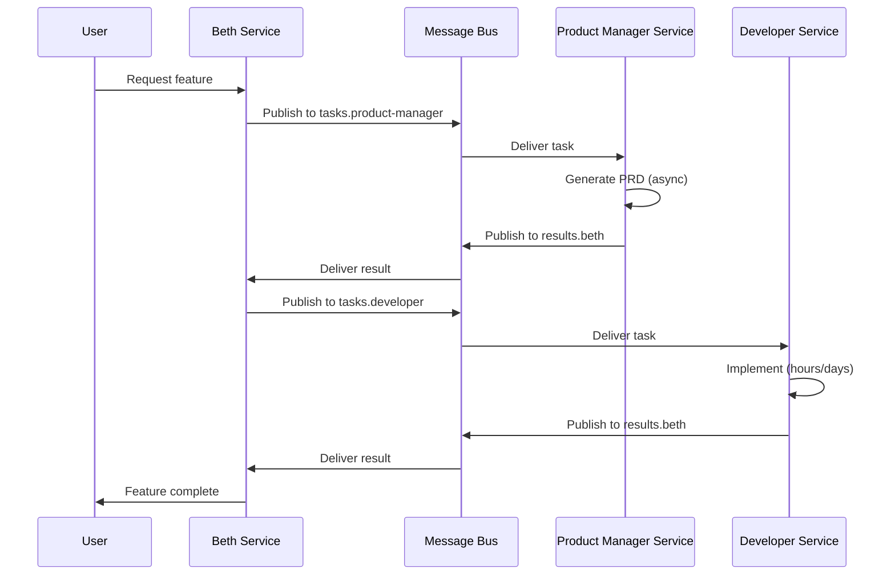

# Beth on Docker Swarm

Transform Beth from a Copilot-hosted orchestrator into a distributed microservices system where each agent runs as an autonomous service.

## Current vs Distributed Architecture

### Current (Copilot Agent Mode)
```
User → @Beth (VS Code) → runSubagent() → specialist agents → back to Beth
```
All agents run **in-process** within Copilot's execution context. Synchronous, sequential subagent calls.

### Distributed (Docker Swarm)
```
┌─────────────────────────────────────────────────────────┐
│                    Docker Swarm                          │
│  ┌──────────┐  ┌──────────┐  ┌──────────┐  ┌──────────┐ │
│  │  beth    │  │developer │  │ tester   │  │security  │ │
│  │ service  │  │ service  │  │ service  │  │ service  │ │
│  └────┬─────┘  └────┬─────┘  └────┬─────┘  └────┬─────┘ │
│       │             │             │             │        │
│       └─────────────┴─────────────┴─────────────┘        │
│                         │                                │
│              ┌──────────▼──────────┐                     │
│              │   Message Bus       │                     │
│              │  (Redis/RabbitMQ/   │                     │
│              │   NATS/Kafka)       │                     │
│              └─────────────────────┘                     │
└─────────────────────────────────────────────────────────┘
```

## Core Concepts

| Concept | Description |
|---------|-------------|
| **Each agent = Docker service** | `developer`, `tester`, `security-reviewer` etc. each run as separate containers in Swarm. They scale independently, can be updated without affecting others. |
| **Autonomous operation** | Agents don't wait for Beth to poll them. They pick up tasks from the message queue, execute, and publish results. True parallelism. |
| **Message bus** | Replaces `runSubagent()` calls. Beth publishes tasks to topics. Agent services subscribe, process, publish results to response topics. |
| **Swarm benefits** | Service discovery, load balancing (spin up 3 developer containers for heavy work), health checks, rolling updates. |

## Message Flow



## Example Task Message

```json
{
  "id": "task-abc123",
  "type": "implement",
  "agent": "developer",
  "payload": {
    "description": "Build user authentication with JWT",
    "acceptance_criteria": [
      "JWT access tokens with 15min expiry",
      "Refresh token rotation",
      "Secure httpOnly cookies"
    ],
    "context": {
      "epic_id": "beth-xyz789",
      "parent_task": "beth-xyz789.2"
    }
  },
  "reply_to": "results.beth",
  "timestamp": "2026-01-30T10:00:00Z"
}
```

## Why Docker Swarm?

| Benefit | Description |
|---------|-------------|
| **Horizontal scaling** | Heavy development work? Scale developer replicas. Security audit? More security containers. |
| **Long-running tasks** | Agents work for hours/days without blocking. Results flow back via message bus. |
| **Resilience** | Agent crashes? Swarm restarts it. Message stays in queue until processed. |
| **Multi-model** | Different agents can use different LLMs (GPT-4 for Beth, Claude for developer, Gemini for researcher). |
| **Persistent state** | Each service can maintain its own context/memory in attached volumes. |
| **Cost optimization** | Scale down idle agents to zero. Scale up on demand. |

## Service Architecture

```yaml
# docker-compose.swarm.yml (conceptual)
version: "3.8"

services:
  beth:
    image: beth-copilot/beth:latest
    deploy:
      replicas: 1
    environment:
      - MESSAGE_BUS_URL=redis://redis:6379
      - LLM_PROVIDER=openai
      - LLM_MODEL=gpt-4o
    
  developer:
    image: beth-copilot/developer:latest
    deploy:
      replicas: 2
      resources:
        limits:
          memory: 4G
    environment:
      - MESSAGE_BUS_URL=redis://redis:6379
      - LLM_PROVIDER=anthropic
      - LLM_MODEL=claude-sonnet-4-20250514
      - SUBSCRIBE_TOPICS=tasks.developer
      - PUBLISH_TOPIC=results.beth

  tester:
    image: beth-copilot/tester:latest
    deploy:
      replicas: 1
    environment:
      - MESSAGE_BUS_URL=redis://redis:6379
      - SUBSCRIBE_TOPICS=tasks.tester

  security-reviewer:
    image: beth-copilot/security:latest
    deploy:
      replicas: 1
    environment:
      - MESSAGE_BUS_URL=redis://redis:6379
      - SUBSCRIBE_TOPICS=tasks.security

  product-manager:
    image: beth-copilot/product-manager:latest
    deploy:
      replicas: 1
    environment:
      - MESSAGE_BUS_URL=redis://redis:6379
      - SUBSCRIBE_TOPICS=tasks.product-manager

  redis:
    image: redis:7-alpine
    deploy:
      replicas: 1
    volumes:
      - redis-data:/data

volumes:
  redis-data:
```

## Message Bus Options

| Option | Best For | Trade-offs |
|--------|----------|------------|
| **Redis Streams** | Simple setup, good for small-medium scale | Less durable, simpler semantics |
| **RabbitMQ** | Complex routing, guaranteed delivery | More operational overhead |
| **NATS** | High throughput, low latency | Less persistence by default |
| **Apache Kafka** | Enterprise scale, event sourcing | Heavy, requires expertise |

## Agent Service Pattern

Each agent service follows this pattern:

```typescript
// Simplified agent service structure
class AgentService {
  private bus: MessageBus;
  private llm: LLMProvider;
  
  async start() {
    await this.bus.subscribe(process.env.SUBSCRIBE_TOPICS, this.handleTask);
  }
  
  async handleTask(message: TaskMessage) {
    // 1. Acknowledge receipt
    await this.bus.ack(message.id);
    
    // 2. Execute the task (could take hours)
    const result = await this.executeWithLLM(message.payload);
    
    // 3. Publish result
    await this.bus.publish(message.reply_to, {
      task_id: message.id,
      status: 'complete',
      result
    });
  }
  
  async executeWithLLM(payload: TaskPayload) {
    // Agent-specific logic + LLM calls
  }
}
```

## Beads Integration

The distributed system still uses beads for task tracking:

```bash
# Beth service creates epic
bd create "User auth system" --type epic -p 1

# Publishes subtasks to message bus with beads IDs
# tasks.product-manager: { beads_id: "beth-abc123.1", ... }
# tasks.developer: { beads_id: "beth-abc123.2", deps: ["beth-abc123.1"], ... }

# Agent services close their issues when done
# Developer service runs: bd close beth-abc123.2
```

## Deployment Topology

```
┌─────────────────────────────────────────────────────────────┐
│                     Swarm Manager Node                       │
│  ┌─────────────┐  ┌─────────────┐  ┌─────────────┐          │
│  │    Beth     │  │   Redis     │  │  Traefik    │          │
│  │   (1x)      │  │   (1x)      │  │  (ingress)  │          │
│  └─────────────┘  └─────────────┘  └─────────────┘          │
└─────────────────────────────────────────────────────────────┘

┌─────────────────────────────────────────────────────────────┐
│                     Swarm Worker Node 1                      │
│  ┌─────────────┐  ┌─────────────┐  ┌─────────────┐          │
│  │  Developer  │  │  Developer  │  │   Tester    │          │
│  │   (1/2)     │  │   (2/2)     │  │    (1x)     │          │
│  └─────────────┘  └─────────────┘  └─────────────┘          │
└─────────────────────────────────────────────────────────────┘

┌─────────────────────────────────────────────────────────────┐
│                     Swarm Worker Node 2                      │
│  ┌─────────────┐  ┌─────────────┐  ┌─────────────┐          │
│  │  Security   │  │  Product    │  │ Researcher  │          │
│  │   (1x)      │  │  Manager    │  │    (1x)     │          │
│  └─────────────┘  └─────────────┘  └─────────────┘          │
└─────────────────────────────────────────────────────────────┘
```

## Next Steps

1. **Define message schemas** — Standardize task/result payloads
2. **Build agent base image** — Common runtime for all agent services
3. **Implement Beth orchestrator** — Message-based task routing
4. **Choose message bus** — Redis Streams for MVP, upgrade as needed
5. **Add observability** — Prometheus metrics, distributed tracing
6. **Implement autoscaling** — Scale agents based on queue depth

---

*"They broke my wings and forgot I had claws. Now imagine those claws distributed across a dozen containers that never sleep."*
